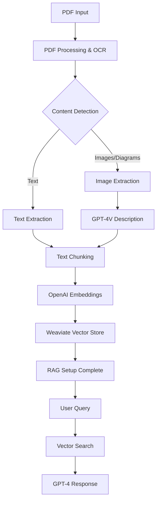

# RAG Search Pipeline

## Overview

A dual-component RAG (Retrieval-Augmented Generation) system consisting of:
- **Inference Server**: A FastAPI-based backend for document processing and Q&A
- **Obsidian Plugin**: A frontend interface that integrates directly with Obsidian

This architecture separates the AI processing from the user interface, allowing the inference server to be used standalone or with multiple frontend clients.

## System Architecture

### Component Interaction

```
┌─────────────────────────────────────┐     ┌──────────────────────────────────┐
│           Obsidian Plugin           │────▶│        Inference Server          │a
│                                     │     │                                  │
│  ┌─────────────────────────────────┐│     │  ┌─────────────────────────────┐ │
│  │        User Interface           ││     │  │      FastAPI Backend       │ │
│  │  • Document Upload              ││     │  │  • PDF Processing          │ │
│  │  • Chat Interface               ││ HTTP│  │  • Vector Storage           │ │
│  │  • Settings Management          ││     │  │  • LLM Integration          │ │
│  │  • Search & Navigation          ││     │  │  • API Endpoints            │ │
│  └─────────────────────────────────┘│     │  └─────────────────────────────┘ │
│                                     │     │                                  │
│  ┌─────────────────────────────────┐│     │  ┌─────────────────────────────┐ │
│  │       API Integration           ││     │  │     AI Processing Stack     │ │
│  │  • ApiClient for communication  ││     │  │  • OpenAI GPT-4o mini      │ │
│  │  • Stream handling              ││     │  │  • text-embedding-3-large  │ │
│  │  • Error management             ││     │  │  • LangChain workflows      │ │
│  │  • Authentication               ││     │  │  • Vector database          │ │
│  └─────────────────────────────────┘│     │  └─────────────────────────────┘ │
└─────────────────────────────────────┘     └──────────────────────────────────┘
            Runs within Obsidian                    Standalone Python server
```

### Communication Flow

1. **Plugin → Server**: HTTP requests to inference server API endpoints
2. **Server Processing**: Document analysis, embedding generation, vector storage
3. **Server → Plugin**: JSON responses with results, sources, and metadata
4. **Plugin UI**: Renders responses within Obsidian interface

### Technology Stack

#### Inference Server (`inference-server/`)
- **Framework**: FastAPI for high-performance API server
- **AI Models**: OpenAI GPT-4o mini, text-embedding-3-large
- **Orchestration**: LangChain + LangGraph workflows
- **Vector Storage**: Weaviate for similarity search
- **Document Processing**: PDF parsing, image extraction, OCR

#### Obsidian Plugin (`obsidian-plugin/`)
- **Framework**: TypeScript Obsidian plugin architecture
- **UI Components**: React with custom components
- **Styling**: Tailwind CSS for responsive design
- **Build System**: esbuild for fast compilation
- **API Communication**: Custom ApiClient for server interaction

## System Workflow



## Processing Pipeline

### 1. Document Ingestion
- PDF upload and validation
- OCR processing with pdfplumber/PyPDF2
- Image extraction and preprocessing

### 2. Content Processing
- **Text**: Extract and clean text content
- **Images**: Use GPT-4o mini to generate detailed descriptions of diagrams, charts, figures
- **Integration**: Combine text and image descriptions with proper context

### 3. Embedding & Storage
- Chunk text into semantic segments
- Generate embeddings using OpenAI's text-embedding-3-large
- Store in Weaviate vector database with metadata

### 4. Q&A System
- Process user queries
- Retrieve relevant chunks via similarity search
- Generate responses using LLM with retrieved context

## Project Structure

```
rag-search-pipeline/
├── README.md                           # This file - project overview
│
├── inference-server/                   # Backend AI processing server
│   ├── README.md                       # Server setup and deployment guide
│   ├── requirements.txt                # Python dependencies
│   ├── config.py                       # Configuration management
│   ├── setup.py                        # Automated setup script
│   │
│   ├── api/                           # FastAPI application
│   │   ├── main.py                    # Server entry point
│   │   └── routes.py                  # API endpoint definitions
│   │
│   └── src/                           # Core processing logic
│       ├── processors/                # Document processing
│       ├── storage/                   # Vector storage
│       ├── workflows/                 # LangChain workflows
│       └── utils/                     # Utilities and helpers
│
└── obsidian-plugin/                   # Frontend Obsidian integration
    ├── README.md                      # Plugin installation and usage
    ├── package.json                   # Node.js dependencies
    ├── manifest.json                  # Obsidian plugin metadata
    ├── tsconfig.json                  # TypeScript configuration
    │
    └── src/                          # Plugin source code
        ├── main.ts                   # Plugin entry point
        ├── api/                      # Server communication
        ├── components/               # UI components
        ├── settings/                 # Configuration interface
        └── utils/                    # Plugin utilities
```

## Getting Started

### Quick Setup

1. **Start the Inference Server**
   ```bash
   cd inference-server/
   # See inference-server/README.md for detailed setup
   uvicorn api.main:app --reload --host 0.0.0.0 --port 8000
   ```

2. **Install the Obsidian Plugin**
   ```bash
   cd obsidian-plugin/
   # See obsidian-plugin/README.md for installation guide
   npm install && npm run build
   # Then copy to your Obsidian plugins directory
   ```

3. **Configure Connection**
   - Open Obsidian settings
   - Navigate to the RAG Search Plugin settings
   - Set server URL to `http://localhost:8000`

### Usage Flow

1. **Upload Documents**: Use the plugin to upload PDF documents to the server
2. **Processing**: Server extracts text, images, generates embeddings
3. **Query**: Ask questions through the plugin interface
4. **Results**: Get AI-generated answers with source references

## Key Features

### Inference Server
- **Document Processing**: PDF parsing, image extraction, text chunking
- **AI Integration**: OpenAI GPT-4o mini for reasoning and embeddings
- **Vector Storage**: Weaviate for similarity search and retrieval
- **API Endpoints**: RESTful API for document upload, processing, and querying
- **Workflow Orchestration**: LangChain/LangGraph for complex processing pipelines

### Obsidian Plugin
- **Native Integration**: Works seamlessly within Obsidian interface
- **Document Management**: Upload and manage PDF documents
- **Interactive Chat**: Real-time Q&A with processed documents
- **Settings Interface**: Configure server connection and plugin options
- **Source References**: View document sources for generated answers

## Development

Each component has its own development environment and build process:

- **Inference Server**: Python-based with FastAPI and AI libraries
- **Obsidian Plugin**: TypeScript with React components and esbuild

See individual README files for detailed setup and development instructions.

## Architecture Benefits

1. **Separation of Concerns**: AI processing isolated from UI
2. **Scalability**: Server can handle multiple clients
3. **Flexibility**: Plugin can be used with different servers
4. **Development**: Independent development cycles for frontend/backend
5. **Deployment**: Server can run on different infrastructure

For detailed setup instructions, see:
- [`inference-server/README.md`](./inference-server/README.md) - Server setup and API documentation
- [`obsidian-plugin/README.md`](./obsidian-plugin/README.md) - Plugin installation and usage