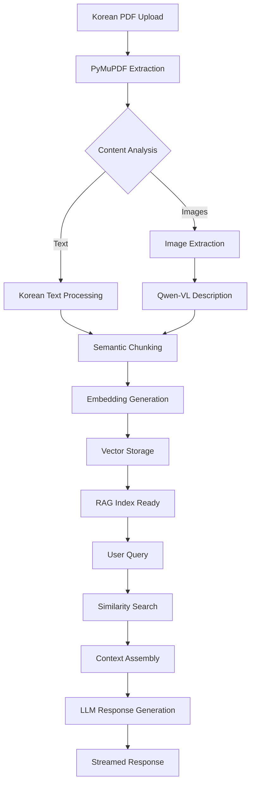

# NotebookLocal - Multi-Modal RAG System

## What We've Built

A comprehensive **multi-modal RAG (Retrieval-Augmented Generation) system** with three integrated components:

### 🎯 **Core Components**
- **📡 Inference Server**: FastAPI backend for document processing and Q&A
- **🤖 Modular Model Router**: Unified API gateway for multiple LLM providers (OpenAI, Anthropic, Qwen, vLLM)
- **📝 Obsidian Plugin**: Native frontend interface within Obsidian

## What We're Trying To Do

### 🎯 **Primary Goals**
1. **🇰🇷 Korean PDF Support**: Advanced document processing for Korean academic/technical documents
2. **🔄 Multi-Modal AI**: Combine text, images, and diagrams for comprehensive understanding
3. **🚀 Flexible LLM Access**: Support both cloud APIs and local models through unified interface
4. **📚 Knowledge Management**: Seamless integration with personal note-taking workflows

### 🎯 **Vision**
Create a **notebook-local AI assistant** that:
- Processes complex Korean documents (PDFs with mixed text/images)
- Provides contextual Q&A based on uploaded content
- Integrates naturally into existing knowledge workflows
- Supports both cloud and local AI models for flexibility

## System Architecture

## How We're Building It

### 🏗️ **Three-Tier Architecture**

```
┌─────────────────────────────────────┐
│           Obsidian Plugin           │
│         (User Interface)            │
│  • Korean document upload          │
│  • Multi-modal chat interface      │  
│  • Real-time streaming responses   │
│  • Integrated note management      │
└─────────────────┬───────────────────┘
                  │ HTTP API
                  ▼
┌─────────────────────────────────────┐
│          Inference Server           │
│       (Document Processing)         │
│  • Korean PDF text extraction      │
│  • Image/diagram processing        │
│  • Vector embedding generation     │
│  • RAG pipeline orchestration      │
└─────────────────┬───────────────────┘
                  │ Model API
                  ▼
┌─────────────────────────────────────┐
│        Modular Model Router         │
│         (AI Model Gateway)          │
│  • OpenAI/Anthropic (Cloud)        │
│  • Qwen-VL (Local Vision)          │
│  • vLLM (Local Text)               │
│  • Adaptive model routing          │
└─────────────────────────────────────┘
```

### 🔄 **Technical Implementation Strategy**

#### **1. Korean Document Processing**
- **PyMuPDF**: Superior Korean font handling vs. pdfplumber
- **Multi-modal extraction**: Text + images + diagrams from PDFs
- **GPT-4V integration**: AI-generated descriptions for visual content
- **Semantic chunking**: Context-aware text segmentation

#### **2. Flexible AI Backend**
- **Model abstraction**: Unified interface for different AI providers
- **Local + Cloud**: Support both self-hosted and API-based models
- **Vision capabilities**: Qwen2.5-VL for local image understanding
- **Performance optimization**: vLLM for fast local inference

#### **3. Seamless User Experience**
- **Native Obsidian integration**: Works within existing workflows
- **Real-time streaming**: Progressive response generation
- **Smart caching**: Minimize API calls and processing time
- **Error resilience**: Graceful fallbacks between model providers

## Current Development Status

### ✅ **Completed Components**

#### 📡 **Inference Server**
- ✅ FastAPI backend with Korean PDF processing
- ✅ PyMuPDF integration for better Korean font support
- ✅ Multi-modal content extraction (text + images)
- ✅ OpenAI integration (GPT-4o, text-embedding-3-large)
- ✅ Vector storage with Weaviate
- ✅ RESTful API endpoints for document processing

#### 🤖 **Modular Model Router** 
- ✅ Unified API gateway architecture
- ✅ Multiple provider support (OpenAI, Anthropic, Qwen)
- ✅ Local model integration (vLLM, Qwen-VL)
- ✅ Configuration-driven routing
- ✅ Async request handling

#### 📝 **Obsidian Plugin**
- ✅ TypeScript plugin architecture
- ✅ React-based UI components
- ✅ Real-time chat interface
- ✅ Document management system
- ✅ Settings configuration panel

### 🚧 **Technology Stack**

#### **Backend (Python)**
- **FastAPI**: High-performance async API server
- **LangChain/LangGraph**: AI workflow orchestration  
- **PyMuPDF**: Korean PDF text extraction
- **Weaviate**: Vector similarity search
- **vLLM**: Local model serving
- **Transformers**: Qwen model integration

#### **Frontend (TypeScript)**
- **Obsidian API**: Native plugin integration
- **React + TypeScript**: Component architecture
- **Tailwind CSS**: Responsive UI design
- **esbuild**: Fast compilation pipeline

## Next Steps & Testing

### 🎯 **Immediate Goals**
1. **End-to-end testing**: Verify complete workflow functionality
2. **Korean document validation**: Test with real Korean academic PDFs
3. **Performance optimization**: Latency and memory usage improvements
4. **Integration polish**: Smooth user experience across components

### 📋 **Testing Checklist**
- [ ] Obsidian plugin builds and loads correctly
- [ ] Inference server processes Korean PDFs successfully  
- [ ] Model router switches between providers seamlessly
- [ ] Complete document → query → response workflow
- [ ] Multi-modal content (text + images) processing
- [ ] Real-time streaming responses

### 🔄 **Processing Pipeline**



## Getting Started

### 🚀 **Quick Setup Guide**

#### 1. **Environment Setup**
```bash
# Ensure Python 3.12 is installed
python3 --version  # Should be 3.12.x

# Clone and navigate
git clone <repository>
cd 26th-summer-NotebookLocal/
```

#### 2. **Start Model Router** (Optional - for local models)
```bash
cd modular_model/
python -m venv venv && source venv/bin/activate
pip install -e .
python src/main.py  # Starts on port 8001
```

#### 3. **Start Inference Server**
```bash
cd inference-server/
python -m venv venv && source venv/bin/activate
pip install -r requirements.txt

# Configure environment
cp .env.example .env
# Edit .env: Add your OPENAI_API_KEY

# Start server
uvicorn api.main:app --reload --host 0.0.0.0 --port 8000
```

#### 4. **Install Obsidian Plugin**
```bash
cd obsidian-plugin/
npm install && npm run build

# Copy to Obsidian plugins directory
mkdir -p ~/.obsidian/plugins/obsidian-copilot/
cp main.js manifest.json styles.css ~/.obsidian/plugins/obsidian-copilot/

# Enable in Obsidian: Settings → Community Plugins → Enable "Obsidian Copilot"
```

### 🧪 **Testing the System**
See [`TESTING_GUIDE.md`](./TESTING_GUIDE.md) for comprehensive testing instructions.

## Project Structure

```
rag-search-pipeline/
├── README.md                           # This file - project overview
│
├── inference-server/                   # Backend AI processing server
│   ├── README.md                       # Server setup and deployment guide
│   ├── requirements.txt                # Python dependencies
│   ├── config.py                       # Configuration management
│   ├── setup.py                        # Automated setup script
│   │
│   ├── api/                           # FastAPI application
│   │   ├── main.py                    # Server entry point
│   │   └── routes.py                  # API endpoint definitions
│   │
│   └── src/                           # Core processing logic
│       ├── processors/                # Document processing
│       ├── storage/                   # Vector storage
│       ├── workflows/                 # LangChain workflows
│       └── utils/                     # Utilities and helpers
│
└── obsidian-plugin/                   # Frontend Obsidian integration
    ├── README.md                      # Plugin installation and usage
    ├── package.json                   # Node.js dependencies
    ├── manifest.json                  # Obsidian plugin metadata
    ├── tsconfig.json                  # TypeScript configuration
    │
    └── src/                          # Plugin source code
        ├── main.ts                   # Plugin entry point
        ├── api/                      # Server communication
        ├── components/               # UI components
        ├── settings/                 # Configuration interface
        └── utils/                    # Plugin utilities
```

## Key Features & Differentiators

### 🇰🇷 **Korean Document Excellence**
- **Advanced font handling**: PyMuPDF > pdfplumber for Korean text
- **Multi-modal processing**: Text + images + diagrams in single workflow
- **Academic PDF focus**: Optimized for Korean research/technical documents

### 🤖 **Flexible AI Architecture**
- **Multi-provider support**: Switch between OpenAI, Anthropic, local models
- **Local model integration**: Qwen-VL for vision, vLLM for fast inference
- **Smart routing**: Route queries to most appropriate model for the task

### 📝 **Native Workflow Integration**
- **Obsidian-first design**: Works within existing note-taking habits
- **Real-time streaming**: Progressive response generation
- **Source transparency**: Clear document references for every response

## Component Details

### 📡 **Inference Server Features**
- Korean PDF processing with PyMuPDF
- Multi-modal content extraction (text + images)
- Vector storage with Weaviate
- LangChain workflow orchestration
- RESTful API endpoints

### 🤖 **Model Router Features**
- Unified API for multiple providers
- Local model serving (Qwen, vLLM)
- Configuration-driven routing
- Async request handling

### 📝 **Obsidian Plugin Features**
- Native Obsidian integration
- Real-time chat interface
- Document management system
- Settings configuration
- Source reference tracking

---

## Development Team & Contact

**Built for the 26th Summer Research Program**
- Multi-modal RAG system for Korean academic document processing
- Local + cloud AI model integration
- Obsidian workflow optimization

For detailed setup and testing instructions, see:
- [`TESTING_GUIDE.md`](./TESTING_GUIDE.md) - Comprehensive testing procedures
- [`inference-server/README.md`](./inference-server/README.md) - Server setup and API docs
- [`obsidian-plugin/README.md`](./obsidian-plugin/README.md) - Plugin installation guide
- [`modular_model/README.md`](./modular_model/README.md) - Model router documentation