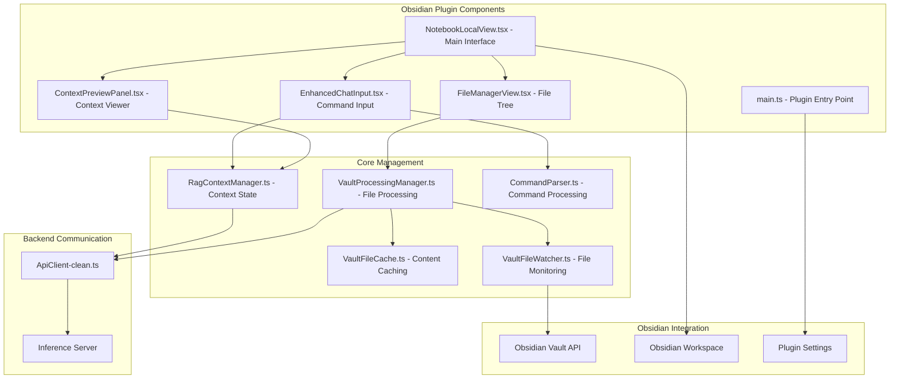

# Obsidian Plugin - Enhanced RAG Chat Interface

The **NotebookLocal Obsidian Plugin** provides an advanced chat interface with RAG context management, real-time file processing, and command-driven interaction for seamless integration with your Obsidian vault.

## 🏗️ Architecture Overview



## 🎯 **Core Features**

### **Enhanced Chat Interface**
- **Tabbed UI**: Chat, Context, and Files views in a single interface
- **Command System**: 11 slash commands + 4 @ mention types
- **Real-time Parsing**: Command highlighting and autocomplete
- **Streaming Responses**: Live response generation with abort capability
- **RAG Integration**: Context-aware conversations with your vault content

### **File Management System**
- **Hierarchical Tree View**: Navigate vault files with folder structure
- **Processing Status**: Real-time indicators (🟢🟡🔄⚪🔴) for file processing state
- **Batch Operations**: Select multiple files for processing or context addition
- **Smart Filtering**: Filter by status, file type, search query
- **Auto-refresh**: Automatic updates when files change

### **RAG Context Management**
- **Visual Context Preview**: See exactly what's included in your RAG context
- **Flexible Scoping**: Choose whole vault, selected files, or folder-based context
- **Context Validation**: Token estimation and warnings for large contexts
- **Dynamic Updates**: Real-time context changes via commands and mentions

### **Command System**
- **Slash Commands**: `/rag-enable`, `/process-file`, `/show-queue`, etc.
- **@ Mentions**: `@filename.md`, `@folder/`, `@#tag`, `@recent`
- **Autocomplete**: Smart suggestions for files, folders, and commands
- **Syntax Highlighting**: Visual feedback for command parsing

## 📁 Project Structure

```
notebook-local/
├── README.md                    # This documentation
├── manifest.json                # Obsidian plugin metadata
├── package.json                 # Node.js dependencies and scripts
├── tsconfig.json                # TypeScript configuration
├── esbuild.config.mjs           # Build configuration
├── .env.example                 # Environment template
│
└── src/                         # Plugin source code
    ├── main.ts                  # Plugin entry point and lifecycle
    ├── constants-minimal.ts     # Plugin constants and view types
    │
    ├── components/              # React UI components
    │   ├── NotebookLocalView.tsx      # Main tabbed interface (Chat/Context/Files)
    │   ├── EnhancedChatInput.tsx      # Command-aware chat input with parsing
    │   ├── FileManagerView.tsx        # File tree with processing status
    │   ├── ContextPreviewPanel.tsx    # RAG context visualization
    │   └── CommandAutocomplete.tsx    # Autocomplete suggestions component
    │
    ├── context/                 # RAG context management
    │   ├── RagContextManager.ts       # Central context state management
    │   └── CommandParser.ts           # Parse slash commands and @ mentions
    │
    ├── vault/                   # File system integration
    │   ├── VaultFileWatcher.ts        # Real-time file change detection
    │   ├── VaultFileCache.ts          # Multi-layer content caching
    │   └── VaultProcessingManager.ts  # Batch file processing coordination
    │
    ├── api/                     # Backend communication
    │   └── ApiClient-clean.ts         # HTTP client with all 14 endpoints
    │
    └── settings/                # Plugin configuration
        ├── SettingsTab.ts             # Obsidian settings integration
        └── model-clean.ts             # Settings model and storage
```

## 🚀 Installation & Setup

### **Prerequisites**
- **Obsidian**: Latest version with community plugins enabled
- **Node.js 16+**: For development and building
- **Inference Server**: Running on localhost:8000
- **Git**: For version control and updates

### **1. Development Installation**

```bash
# Clone repository
cd your-obsidian-vault/.obsidian/plugins/
git clone <repository-url> notebook-local
cd notebook-local

# Install dependencies
npm install

# Build plugin
npm run build
```

### **2. Production Installation**

```bash
# Download from Obsidian Community Plugins (when available)
# Or manually install:

# Copy built files to your vault
cp -r dist/* /path/to/vault/.obsidian/plugins/notebook-local/

# Enable in Obsidian:
# Settings → Community plugins → Enable "NotebookLocal"
```

### **3. Configuration**

After installation, configure the plugin:

1. **Open Obsidian Settings** → Community plugins → NotebookLocal
2. **Set Server URL**: `http://localhost:8000` (default)
3. **Configure Model Settings**: Choose preferred AI model
4. **Enable Streaming**: For real-time responses (recommended)

### **4. Start Using**

```bash
# Open NotebookLocal interface
- Click ribbon icon (message-circle), or
- Command palette: "NotebookLocal: Open Chat", or
- Hotkey (if configured)
```

## 🎮 **Usage Guide**

### **Getting Started Workflow**

1. **Open the Plugin**
   - Ribbon icon or command palette
   - Interface opens in right sidebar with 3 tabs

2. **Enable RAG System**
   ```
   /rag-enable
   ```
   → RAG indicator appears in header

3. **Add Content to Context**
   ```
   @important-notes.md @research-folder/ @#meeting-tag
   ```
   → Switch to Context tab to see what's included

4. **Check File Processing Status**
   - Switch to Files tab
   - Look for status indicators: 🟢 (processed), 🟡 (queued), etc.
   - Process unprocessed files: select files → "Process" button

5. **Ask Questions**
   ```
   What are the main themes in my research notes?
   ```

### **Command Reference**

#### **Slash Commands (11 total)**
```bash
/rag-enable          # Enable RAG system
/rag-disable         # Disable RAG system  
/rag-toggle          # Toggle RAG on/off
/rag-scope whole     # Use entire vault for context
/rag-scope selected  # Use only selected files/folders
/rag-clear           # Clear current RAG context
/rag-status          # Show current RAG status
/process-file path   # Queue specific file for processing
/process-folder path # Process entire folder
/reindex-vault       # Rebuild entire search index
/show-files          # Display file processing status
/show-queue          # Show current processing queue
```

#### **@ Mention System (4 types)**
```bash
@filename.md         # Add specific file to context
@folder/             # Add all files in folder to context
@#tag                # Add files with specific tag to context
@recent              # Add recently modified files
@active              # Add currently active file
@current             # Add current file in editor  
@all                 # Add all vault files
```

### **Advanced Usage Examples**

#### **Complex Context Setup**
```bash
/rag-scope selected
@meeting-notes/ @project-documents/ @#important
/rag-status
```

#### **File Processing Workflow**
```bash
/show-files          # Check what needs processing
/process-folder research/  # Process entire research folder
/show-queue          # Monitor processing progress
```

#### **Smart Querying**
```bash
@quarterly-reports.md What were our Q3 metrics?
/rag-scope folder @2024-data/ Compare this year to last year
@#meetings What action items do we have pending?
```

## 🖥️ **User Interface Guide**

### **Main Interface (3 Tabs)**

#### **💬 Chat Tab**
- **Message Area**: Conversation history with sources
- **Enhanced Input**: Command-aware input with highlighting
- **Status Indicators**: RAG enabled/disabled, connection status
- **Streaming Display**: Real-time response generation

#### **📋 Context Tab**  
- **Context Preview**: Visual representation of current RAG context
- **File/Folder Lists**: What's included in your context
- **Statistics**: Token estimation, processing status
- **Quick Actions**: Remove items, reprocess files, navigate to files

#### **📁 Files Tab**
- **Tree View**: Hierarchical display of vault files
- **Status Indicators**: Color-coded processing status for each file
- **Batch Operations**: Multi-select for processing or context addition
- **Filtering**: Search, filter by status/type, sort options

### **Status Indicators**

| Icon | Status | Meaning |
|------|--------|---------|
| 🟢 | processed | File is processed and searchable |
| 🟡 | queued | File is queued for processing |
| 🔄 | processing | File is currently being processed |
| ⚪ | unprocessed | File hasn't been processed yet |
| 🔴 | error | Processing failed, check error message |

### **Context Preview Elements**

- **📄 Selected Files**: Individual files added to context
- **📁 Selected Folders**: Folders (and their contents) in context  
- **🏷️ Selected Tags**: Files with specific tags
- **🕒 Temporal Filters**: Recent files, active files, etc.
- **📊 Statistics**: Total files, processed count, token estimation
- **⚠️ Warnings/Errors**: Context validation feedback

## 🔧 **Component Architecture**

### **Main Interface Component**
```typescript
// NotebookLocalView.tsx - Core interface with tabs
interface NotebookLocalViewState {
  currentView: 'chat' | 'files' | 'context';
  ragContext: RagContext | null;
  messages: Message[];
  isStreaming: boolean;
}

// Features:
- Tabbed navigation between Chat/Context/Files
- Real-time RAG context synchronization  
- Streaming chat with abort capability
- Command execution and result display
```

### **Enhanced Chat Input**
```typescript
// EnhancedChatInput.tsx - Command-aware input
interface EnhancedChatInputProps {
  onSubmit: (message: string, parsed: ParsedMessage) => void;
  disabled: boolean;
  ragContext: RagContext | null;
}

// Features:
- Real-time command parsing and highlighting
- Autocomplete for commands, files, folders
- Syntax highlighting for @ mentions and / commands
- Multi-line input with Enter/Shift+Enter handling
```

### **File Manager View**
```typescript
// FileManagerView.tsx - Hierarchical file browser
interface FileManagerViewProps {
  onFileSelect?: (file: TFile) => void;
  onAddToContext?: (paths: string[]) => void;
}

// Features:
- Tree view of vault files with folder structure
- Real-time processing status indicators
- Multi-select with batch operations (process, add to context)
- Filtering by status, file type, search query
- Auto-refresh on file changes
```

### **Context Preview Panel**
```typescript
// ContextPreviewPanel.tsx - RAG context visualization  
interface ContextPreviewPanelProps {
  ragContext: RagContext;
  onContextChange: (context: RagContext) => void;
}

// Features:
- Visual representation of current RAG context
- Expandable sections for files/folders/tags/temporal filters
- Context validation with warnings and statistics
- Quick actions: remove items, reprocess, navigate
```

## 🔄 **Core Management Systems**

### **RAG Context Manager**
```typescript
// RagContextManager.ts - Central context state management
class RagContextManager {
  // Context state management
  async getCurrentContext(): Promise<RagContext>
  async setContext(context: RagContext): Promise<void>
  async validateContextSelection(): Promise<ContextValidationResult>
  
  // Command execution
  async executeSlashCommand(command: SlashCommand): Promise<string>
  async handleAtMentions(mentions: AtMention[]): Promise<void>
  
  // Statistics and validation
  getContextStatistics(): ContextStats
  estimateTokenCount(): number
}
```

### **Vault Processing Manager**
```typescript
// VaultProcessingManager.ts - File processing coordination
class VaultProcessingManager {
  // File processing
  async processSingleFile(file: TFile, forceReprocess?: boolean): Promise<void>
  async processVaultFiles(files: TFile[], forceReprocess?: boolean): Promise<void>
  async queueFiles(files: TFile[]): Promise<void>
  
  // Status tracking  
  getProcessingStats(): ProcessingStats
  isFileProcessed(file: TFile): boolean
  getFileStatus(file: TFile): ProcessingStatus
}
```

### **Vault File Watcher**
```typescript
// VaultFileWatcher.ts - Real-time file change detection
class VaultFileWatcher {
  // Features:
  - Debounced file change detection (5-second delay)
  - Content-based change detection using MD5 hashing
  - Automatic processing queue updates
  - Integration with Obsidian file system events
  - Memory and performance optimized
}
```

### **Command Parser**
```typescript
// CommandParser.ts - Parse commands and mentions
interface ParsedMessage {
  originalMessage: string;
  cleanMessage: string;          // Message without commands
  slashCommands: SlashCommand[];  // Parsed / commands
  atMentions: AtMention[];       // Parsed @ mentions
}

// Supported commands:
- 11 slash commands for RAG and processing control
- 4 @ mention types for context management
- Real-time validation and error detection
- Autocomplete suggestions
```

## 🔧 **Configuration & Settings**

### **Plugin Settings**
```typescript
// Settings accessible via Obsidian Settings → NotebookLocal
interface PluginSettings {
  serverUrl: string;              // Inference server URL
  timeout: number;                // Request timeout (ms)  
  enableStreaming: boolean;       // Enable streaming responses
  defaultModel: string;           // Preferred AI model
  autoProcess: boolean;           // Auto-process new files
  debounceDelay: number;          // File change detection delay
  maxConcurrentProcessing: number; // Processing parallelism
}
```

### **Environment Configuration**
```bash
# .env file (optional)
INFERENCE_SERVER_URL=http://localhost:8000
DEFAULT_MODEL=gpt-4
ENABLE_STREAMING=true
AUTO_PROCESS_FILES=false
DEBOUNCE_DELAY=5000
MAX_CONCURRENT_PROCESSING=3
```

### **Advanced Configuration**
```typescript
// Fine-tune processing behavior
const PROCESSING_CONFIG = {
  supportedExtensions: ['.md', '.pdf', '.txt', '.docx'],
  chunkSize: 1000,
  chunkOverlap: 200,
  maxFileSize: 50 * 1024 * 1024, // 50MB
  processingTimeout: 300000,      // 5 minutes
  retryAttempts: 3,
  cacheExpiration: 3600          // 1 hour
};
```

## 🔌 **API Integration**

### **Backend Communication**
```typescript
// ApiClient-clean.ts - Complete HTTP client
class ApiClient {
  // Chat endpoints
  async chat(request: ChatRequest): Promise<ChatResponse>
  async chatStream(request: ChatRequest): AsyncGenerator<string>
  
  // Vault management (8 endpoints)
  async getVaultFiles(status?, fileType?, limit?, offset?): Promise<VaultFileResponse[]>
  async scanVault(request: VaultScanRequest): Promise<any>
  async processVaultFiles(request: VaultProcessRequest): Promise<any>
  async getVaultStatus(): Promise<VaultStatusResponse>
  
  // RAG context management (6 endpoints)  
  async setRagContext(context: RagContextRequest): Promise<any>
  async getRagContext(): Promise<RagContextResponse>
  async validateRagContext(context: RagContextRequest): Promise<ContextValidationResponse>
  async parseCommand(command: string): Promise<CommandParseResponse>
  async getAutocompleteSuggestions(query, type, limit?): Promise<AutocompleteResponse>
  async contextAwareSearch(query, context, limit?, threshold?): Promise<any>
}
```

### **Real-time Synchronization**
```typescript
// Keep plugin state synchronized with backend
const syncManager = {
  // File status synchronization
  syncFileStatus: async () => {
    const serverStatus = await apiClient.getVaultStatus();
    const localFiles = await getLocalFiles();
    await reconcileStatus(serverStatus, localFiles);
  },
  
  // Context synchronization
  syncRagContext: async () => {
    const serverContext = await apiClient.getRagContext();
    ragContextManager.updateContext(serverContext);
  },
  
  // Periodic sync (every 30 seconds)
  startPeriodicSync: () => setInterval(this.syncAll, 30000)
};
```

## 🐛 **Troubleshooting**

### **Common Issues**

1. **Plugin Won't Load**
   ```bash
   # Check Obsidian developer console (Ctrl+Shift+I)
   # Common causes:
   - Missing dependencies in node_modules/
   - Build errors in main.js
   - Incompatible Obsidian version
   
   # Solutions:
   npm install && npm run build
   # Check manifest.json minAppVersion
   ```

2. **Server Connection Failed**
   ```bash
   # Check inference server status
   curl http://localhost:8000/health
   
   # Verify plugin settings
   # Settings → NotebookLocal → Server URL
   
   # Check network connectivity
   ping localhost
   ```

3. **Commands Not Working**
   ```bash
   # Check command syntax:
   /rag-enable         # ✅ Correct
   / rag-enable        # ❌ No spaces
   /RAG-ENABLE         # ❌ Case sensitive
   
   # Check @ mentions:
   @filename.md        # ✅ Correct
   @filename           # ❌ Include extension
   @ filename.md       # ❌ No spaces
   ```

4. **Files Not Processing**
   ```bash
   # Check file types (supported: .md, .pdf, .txt, .docx)
   # Check file size (max: 50MB)
   # Check processing queue: /show-queue
   # Check server logs for errors
   
   # Manual processing:
   /process-file path/to/document.md
   ```

5. **Context Not Updating**
   ```bash
   # Check RAG status: /rag-status
   # Verify files are processed (🟢 in Files tab)
   # Check context validation in Context tab
   # Try clearing and rebuilding: /rag-clear then add files again
   ```

### **Debug Mode**
```typescript
// Enable debug logging
localStorage.setItem('notebook-local-debug', 'true');

// Check console for detailed logs:
// - Command parsing results
// - API request/response details
// - File processing status updates
// - Context changes and validation
```

### **Performance Issues**
```bash
# If plugin is slow:
1. Reduce debounce delay (Settings → Advanced)
2. Limit concurrent processing (Settings → Advanced)  
3. Clear file cache (restart Obsidian)
4. Check system resources (CPU, memory)
5. Optimize vault size (archive unused files)
```

## 🚀 **Development**

### **Building the Plugin**
```bash
# Development build with watch mode
npm run dev

# Production build  
npm run build

# Version and release
npm run version
```

### **Development Workflow**
```bash
# 1. Make changes to source code
# 2. Build plugin
npm run build

# 3. Reload plugin in Obsidian
# Settings → Community plugins → NotebookLocal → Reload

# 4. Test changes in Obsidian
# Use developer console for debugging
```

### **Adding New Commands**

1. **Define command in CommandParser.ts**:
```typescript
const SLASH_COMMANDS = {
  'my-new-command': 'Description of new command'
};
```

2. **Add execution logic in RagContextManager.ts**:
```typescript
async executeSlashCommand(command: SlashCommand): Promise<string> {
  switch (command.command) {
    case 'my-new-command':
      return await this.handleMyNewCommand(command.args);
  }
}
```

3. **Add API support if needed**:
```typescript
// ApiClient-clean.ts
async myNewEndpoint(): Promise<any> {
  const response = await fetch(`${this.baseUrl}/api/v1/my-endpoint`);
  return await response.json();
}
```

### **Testing**
```typescript
// Manual testing workflow
1. Test command parsing: try various command formats
2. Test file processing: upload different file types  
3. Test context management: add/remove files from context
4. Test streaming: enable/disable streaming responses
5. Test error handling: invalid commands, network errors

// Automated testing (if implemented)
npm test
```

## 📈 **Performance Optimization**

### **Memory Management**
- **Lazy Loading**: Load file tree and metadata on demand
- **Cache Cleanup**: Automatic cleanup of expired cache entries
- **Component Unmounting**: Proper cleanup when switching tabs
- **Event Listener Management**: Remove listeners to prevent memory leaks

### **Network Optimization**
- **Request Batching**: Combine multiple API calls when possible
- **Response Caching**: Cache frequently requested data
- **Streaming**: Use streaming for large responses
- **Connection Pooling**: Reuse HTTP connections

### **UI Performance**
- **Virtual Scrolling**: For large file lists (if implemented)
- **Debounced Updates**: Prevent excessive re-renders
- **Memoization**: Cache expensive computations
- **Optimistic Updates**: Update UI before server confirms

```typescript
// Example performance optimizations
const PERFORMANCE_CONFIG = {
  debounceDelay: 300,        // UI update debouncing
  cacheExpiration: 300000,   // 5 minutes
  maxCachedItems: 1000,      // Limit cache size
  batchSize: 50,             // Batch API requests
  renderThreshold: 100       // Virtual scrolling threshold
};
```

## 🔐 **Security Considerations**

### **Data Privacy**
- **Local Processing**: File content stays in your vault
- **Encrypted Communication**: HTTPS for API calls (in production)
- **No Data Retention**: Server doesn't store personal data
- **Configurable Models**: Choose between cloud and local AI models

### **Input Validation**
- **Command Sanitization**: Validate all command inputs
- **Path Validation**: Prevent directory traversal attacks
- **File Type Checking**: Only process supported file types
- **Size Limits**: Prevent processing of excessively large files

### **Network Security**
- **CORS Handling**: Proper cross-origin request handling
- **API Authentication**: Support for API keys (if required)
- **Rate Limiting**: Prevent API abuse
- **Timeout Management**: Prevent hanging requests

---

**Built for the NotebookLocal RAG System**
- Advanced Obsidian plugin with RAG integration
- Real-time file processing and context management
- Command-driven user experience with visual feedback  
- Seamless integration with your knowledge management workflow

For backend server documentation, see: [📡 Inference Server README](../inference-server/README.md)